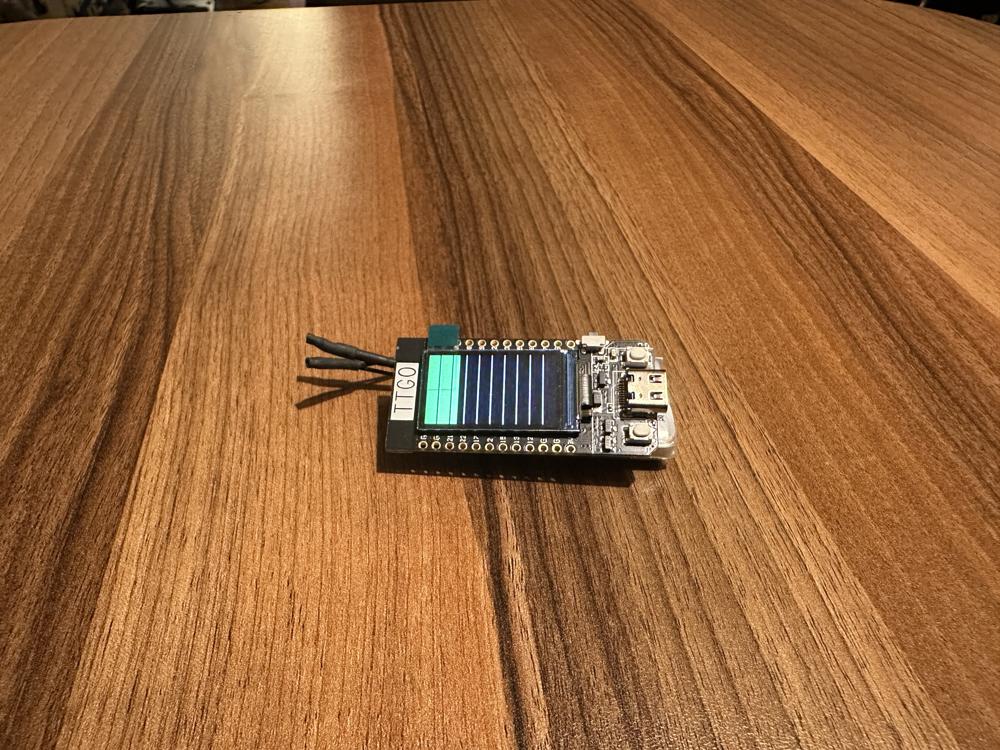
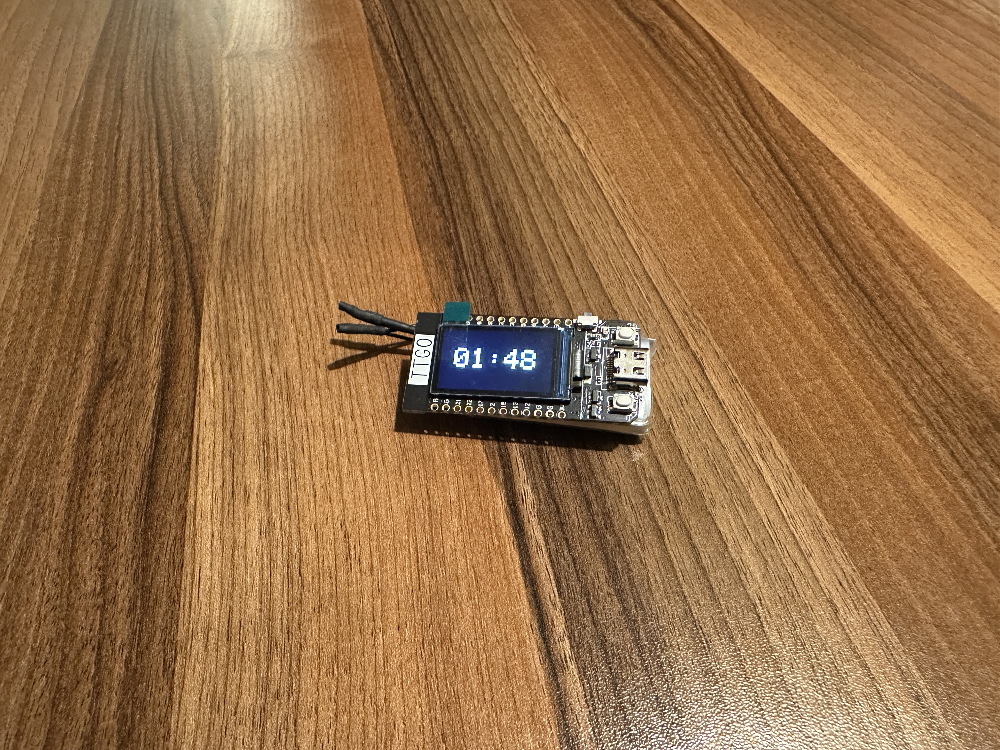
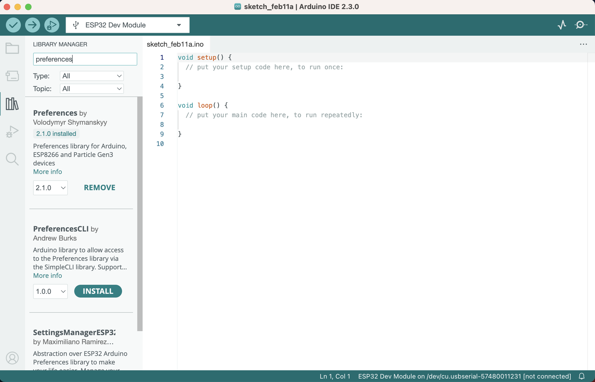
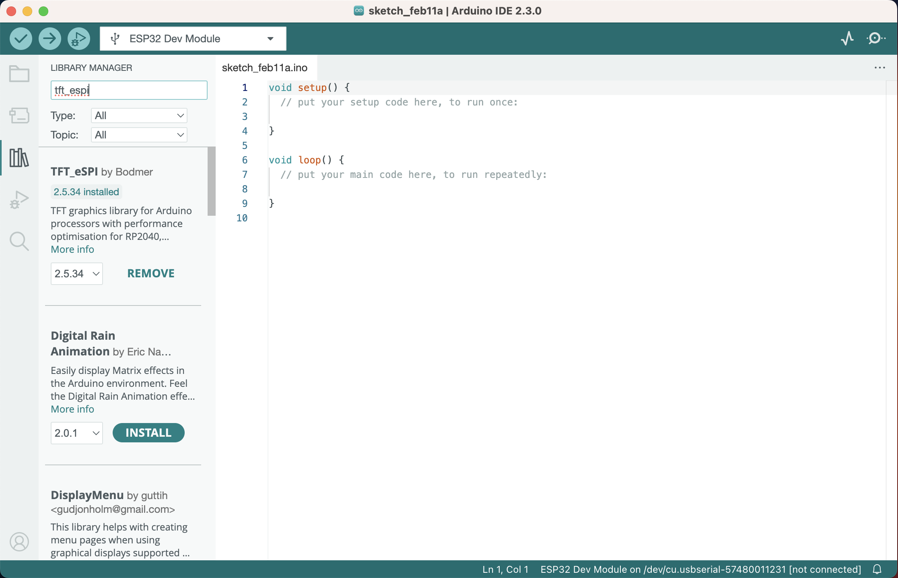

## About OfficeGear
I am thrilled to introduce my latest work - OfficeGear, a smart(not yet😅) solution designed to enhance your health and productivity at the office. 

In today's fast-paced work environment, it's easy to neglect our basic health needs - staying hydrated and moving around. That's why I’ve developed OfficeGear, a device that tracks your daily hydration levels and sedentary time, encouraging you to make healthier choices throughout your workday. 💧🏃‍♂️

### Discover OfficeGear
#### A Glimpse
Water intake bar indicator:



Sitting time display:




With OfficeGear, you can:
- Set personalized daily water intake goals. 💦
- Customize sedentary time alerts, reminding you to stand up and move. 🕒
- Track your progress with an intuitive display, akin to a battery charge bar, but for your health! 🔋 

This tool is not just about tracking; it's about empowering office workers to stay hydrated and reduce prolonged sitting time, which are crucial for long-term health and well-being. 🌿

#### Hardware components
- ESP32 WiFi Bluetooth Development Board from [LILYGO T-Display](https://www.lilygo.cc/en-pl/products/lilygo®-ttgo-t-display-1-14-inch-lcd-esp32-control-board)
- 3,7V 1100mAh Lithium Batterie from [Amazon](https://www.amazon.de/1100mAh-Schutzplatine-Isolierband-1-25-Stecker-ESP32-Entwicklungsplatine/dp/B087LTZW61/ref=asc_df_B087LTZW61/?tag=googshopde-21&linkCode=df0&hvadid=427625050512&hvpos=&hvnetw=g&hvrand=17111390587789641044&hvpone=&hvptwo=&hvqmt=&hvdev=c&hvdvcmdl=&hvlocint=&hvlocphy=1004234&hvtargid=pla-907068602140&psc=1&mcid=f0d3652e825f3c07a3478b6b864cf859&th=1&psc=1&tag=&ref=&adgrpid=98992060069&hvpone=&hvptwo=&hvadid=427625050512&hvpos=&hvnetw=g&hvrand=17111390587789641044&hvqmt=&hvdev=c&hvdvcmdl=&hvlocint=&hvlocphy=1004234&hvtargid=pla-907068602140)


### User Interaction
Faced with the challenge of having only two buttons on this LILYGO T-Display board, a versatile navigation system is crafted, which leverages different menu contexts and button patterns—single click, double click, and long press to ensure a seamless and intuitive user experience. <br>


### Checkout the video
[](https://www.youtube.com/watch?v=P47Cwe5VacM&t=25s "Watch Video")


### Download and Installation
Deploy your OfficeGear to a [LILYGO T-Display](https://www.lilygo.cc/en-pl/products/lilygo®-ttgo-t-display-1-14-inch-lcd-esp32-control-board) ESP32 board.

#### 1. In Arduino IDE, install Preferences and TFT_eSPI library
[Preferences](https://github.com/vshymanskyy/Preferences): used for ESP32 on-chip Flash write/read.




[TFT_eSPI](https://github.com/Bodmer/TFT_eSPI): used for TFT display.



#### 2. Clone this repository
```
git clone https://github.com/yanxuceo/OfficeGear.git
```

#### 3. Open a New Sketch
Navigate to the folder where you cloned the repository on your computer. Look for the OfficeGear.ino and launch in Arduino IDE.


#### 4. Connect board to computer and select Board in Arduino IDE
After selecting the board(ESP32 Dev Module), wait for the IDE to detect and connect to the ESP32 board through a serial port. 


#### 5. Upload code to board


#### 6. Done
After the flashing process is complete, the display will show five bars by default.


## License
This project is licensed under the MIT License - see the [LICENSE](LICENSE) file for details.


